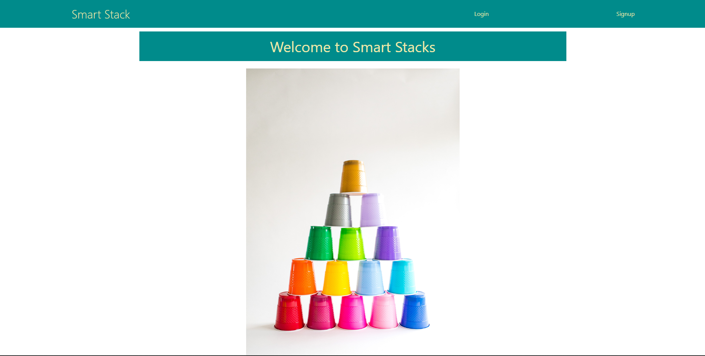

# Smart-Stack

 ## Description
 The purpose of this project was to build an application that helps recent coding bootcamp graduates prepare for the technical interview. Coding bootcamp sessions move very quickly and it’s easy to miss some simple concepts.  Smart Stack can also be used as a tool to review basic concepts that may have been missed during the bootcamp course. Smart Stack is an interactive and easy to use interface where the user can pick which topic they want to learn about and they will presented with popular interview questions for that topic. A big part of the motivation to build this application was not only to create a useful web application to help graduates prepare for the next step in landing a job, but to gain a better understanding of popular developer tools such as REACT, Express, node, and NoSql database like MongoDB.       

 ## Table of Contents

- [Installation](#installation)
- [Usage](#usage)
- [License](#license)
- [How to contribute](#how-to-contribute)
- [Tests](#tests)
- [Questions](#questions)

## Installation
A link to the Smart Stack application can found here: https://smart-stack.herokuapp.com/

No further installation is required to test out the application. The repository containing the working code to the application can be found here: https://github.com/oriarh/Smart-Stack

To run this application from VS Code, clone a copy of the repository from GitHub. Install inquirer by typing "npm install inqurier@8.2.4". In the terminal, navigate to the top level of the repository, and type "npm run develop".

## Usage
The user can access the website application by clicking on the Smart Stack Application link above, and signing up as a user. Once the user submits their details in the sign up form. The user will be automatically redirected to the login page where they will be asked to enter in their email and password once more. Upon clicking on the submit button, the user will be taken to the main page where the user will be presented with the first flashcard question. Clicking on the card will cause the card to flip over and the backside of the card will reveal the correct answer to the question. The user should then click on the card again to flip the card back to the question side before clicking on the next button. The next button will change the card to the next question. If the user wishes to log out, the user may click on the logout button in the navigation page.

**Note**: This lay out is designed to be viewed in either desktop viewing, ipads, or mobile phones. The webpage content does adjust to screen size.

## License
MIT License

A short and simple permissive license with conditions only requiring preservation of copyright and license notices. Licensed works, modifications, and larger works may be distributed under different terms and without source code. Refer to link for more details: https://choosealicense.com/licenses/mit/

## How to Contribute
Feel free to contribute to our project on GitHub. A link to the repository is above and a link to my GitHub page is provided in the Questions section.

## Tests
N/A  

## Questions
Feel free to view and contribute to our on GitHub pages.
https://github.com/naser421

https://github.com/oriarh

https://github.com/SeanBL

For additional questions, can also reach us through our email address here:

Naser Suleiman
naser.4211997@gmail.com

Osama Pervez Riarh
osamapervezriar@gmail.com

Sean Bristol-Lee
seanbristol81@gmail.com